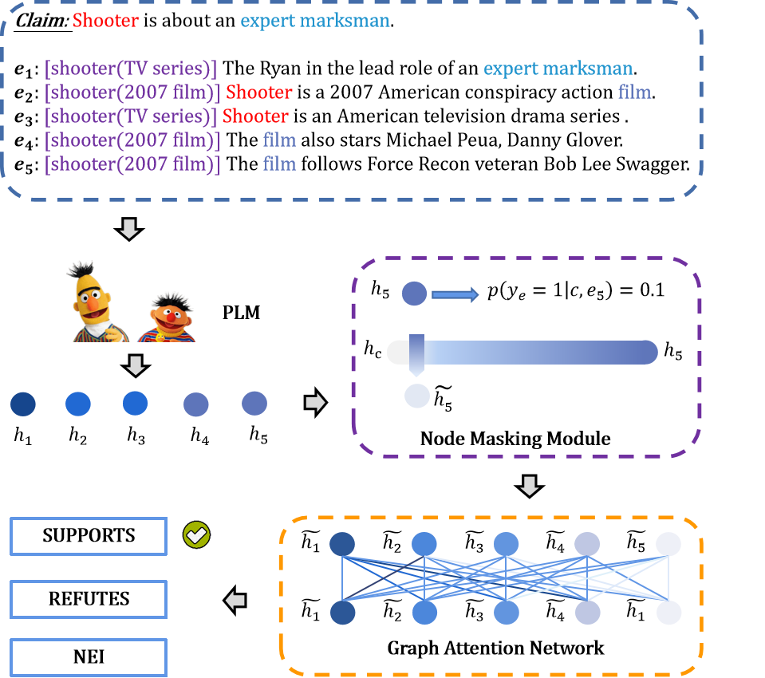

# Multi-Evidence based Fact Verification via A Confidential Graph Neural Network
Source code for our TBD paper : [Multi-Evidence based Fact Verification via A Confidential Graph Neural Network](https://arxiv.org/pdf/2405.10481)

Click the links below to view our papers and checkpoints

<a href='https://arxiv.org/pdf/2405.10481'></a>
<a href='https://huggingface.co/yuqinglanok/CO-GAT/tree/main'></a>


If you find this work useful, please cite our paper  and give us a shining star 🌟

```
@misc{lan2024multievidence,
      title={Multi-Evidence based Fact Verification via A Confidential Graph Neural Network}, 
      author={Yuqing Lan and Zhenghao Liu and Yu Gu and Xiaoyuan Yi and Xiaohua Li and Liner Yang and Ge Yu},
      year={2024},
      eprint={2405.10481},
      archivePrefix={arXiv},
      primaryClass={cs.LG}
}
```

## Overview
<p align="center">
  
</p>

## Requirement
**1. Install the following packages using Pip or Conda under this environment**

```
Python==3.7
Pytorch
transformers
```
We provide the version file `requirements.txt` of all our used packages, if you have any problems configuring the environment, please refer to this document.

## Reproduce CO-GAT
### Download Code & Dataset
* First, use `git clone` to download this project:
```bash
git clone https://github.com/NEUIR/CO-GAT
cd CO-GAT
```
* Download link for [FEVER](https://github.com/thunlp/KernelGAT?tab=readme-ov-file)
* Download link for [SCIFACT(CO-GAT)](https://drive.google.com/drive/folders/18yhie4dNn7GaM6bZLn0_o5xc8hgLlGQp?usp=sharing).
* Place the downloaded dataset in the data folder:
```
data/
├──fever/
│   ├── bert_train.json
│   ├── bert_dev.json
│   ├── bert_test.json
│   └── bert_eval.json
└──scifact/
    ├── prediction
    ├── corpus.jsonl
    ├── train_cogat.json
    ├── dev_cogat.json
    ├── claims_dev.json
    └── claim_test.json
```

### Train CO-GAT
**I will show you how to reproduce the results in the CO-GAT paper.**

* For the FEVER dataset: Go to the ``cogat-fever`` folder and train the CO-GAT model [checkpoint](https://huggingface.co/yuqinglanok/CO-GAT/tree/main/cogat_electra_large):
```
cd cogat-fever
bash train_twostep.sh
```
* For the SCIFACT dataset: Go to the ``cogat-scifact`` folder and train the CO-GAT model [checkpoint](https://huggingface.co/yuqinglanok/CO-GAT/tree/main/cogat_electra_large_scifact):
```
cd cogat-scifact
bash train.sh
```

## Evaluate Prediction Effectiveness
* These experimental results are shown in Table 3 of our paper.
* Go to the ``cogat-fever`` or ``cogat-scifact`` folder and evaluate model performance as follow:
```
bash test.sh
bash inference.sh
```

## Results
The results are shown as follows.
- FEVER


| | Model                               | ACC | F1 |
|----------------|------------------------------|:------:|:------:|
| DEV  | CO_GAT(ELECTRA-base)                             |78.84 |76.77|
| DEV  | CO_GAT(ELECTRA-large)                             |81.65 |79.32|
| TEST  | CO_GAT(ELECTRA-base)                             |74.56 |71.43|
| TEST  | CO_GAT(ELECTRA-large)                             |77.27| 73.59|

- SCIFACT

| | Model                               | PREC-S | REC-S |F1-S| PREC-A | REC-A |F1-A|
|----------------|------------------------------|:------:|:------:|:------:|:------:|:------:|:------:|
| DEV  | CO_GAT(ELECTRA-base)                             |63.39 |38.80 |48.14 |72.00| 43.06| 53.89 |
| DEV  | CO_GAT(ELECTRA-large)                             |58.08 |40.81 |47.94| 67.11 |45.05 |53.91|
| TEST  | CO_GAT(ELECTRA-base)                             |71.49 |48.63 |57.89 |79.58 |54.07 |64.39 |
| TEST  | CO_GAT(ELECTRA-large)                             |55.31 |47.84 |51.30 |69.64 |52.70 |60.0|

## Contact
If you have questions, suggestions, and bug reports, please email:
```
lanyuqing@stumail.neu.edu.cn     
```